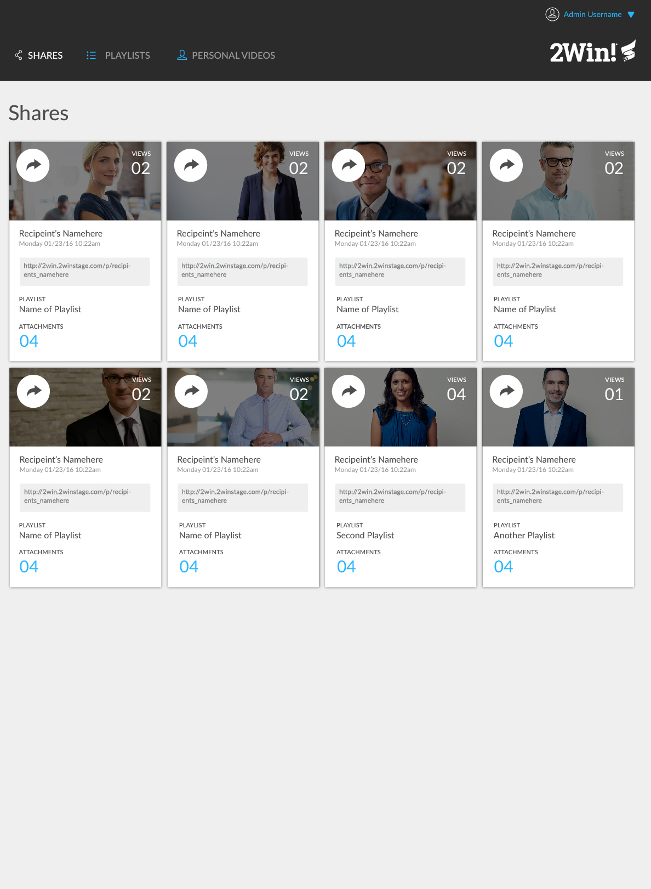

# na-comp-challenge-1

## Overview 
 * This is a project I worked for static-comp challenge for my Turing school, module 1. I created this webpage from scratch and all the
 images and comp that are used in this design is taken from the web. While desiging this web-page, the most challenging thing for me was to get
 menu items and images in-line. Even though it seemed too easy for it looks, it took me number of days of hard work to get it done. 
 
 
##Tools 
* HTML 
* CSS
* A little bit of inspiration from bootstrap just to see what code can make that menu item work. 
* CSS flex 

##Original Comp 

#My comp image 
![Screenshot] (comp.png)

